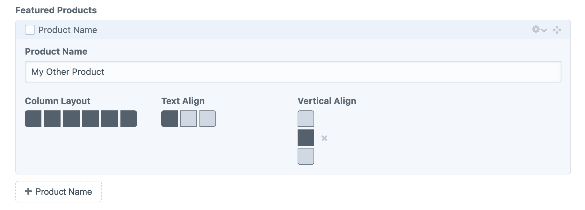

# Little Layout plugin for Craft CMS 4.x

A compact, visual way to lay out fields, elements, and Matrix blocks.

## Requirements

This plugin requires Craft CMS 4.0 or later.

## Installation

To install the plugin, follow these instructions.

1. Open your terminal and go to your Craft project:

        cd /path/to/project

2. Then tell Composer to load the plugin:

        composer require wbrowar/craft-little-layout

3. In the Control Panel, go to Settings → Plugins and click the “Install” button for Little Layout.

4. Create and configure new Little Layout fields for your elements.

## Little Layout Overview

Little Layout is a compact field that makes it easy for content authors to adjust the layout of their content or UI and other design elements. It gives developers values that make it easy to move content around CSS grid layouts or around a set of coordinates. Little Layout fields are accessible and mobile-friendly.

## Configuring Little Layout

When setting up a new Little Layout field, you will need to define how many columns and rows are available in your field. A preview of your field will appear and will get updated as you adjust your settings.

After your columns and rows are set, you can set a default value in your field preview. It works just like the field does during the author experience:

- Click on a box to select it
- Click on another box to draw a rectangle between the two selected points, selecting all points within the rectangle
- Once a value is added, click on the "x" icon to the right to clear the field

Use the Empty Layout setting to determine if authors can clear out the layouts they have set. _NOTE: setting your field to `required` also removes the author’s ability to clear field layouts, regardless of this setting._


## Using Little Layout

The following data can be retrieved in your Twig- or GraphQL-based templates:

| Property | Description |
|---|---|
| **empty** | Determine if field has a value. |
| **gridColumnStart** | Value for CSS Grid’s `grid-column-start` and `grid-column` properties. |
| **gridColumnEnd** | Value for CSS Grid’s `grid-column-end` and `grid-column` properties. |
| **gridRowStart** | Value for CSS Grid’s `grid-row-start` and `grid-row` properties. |
| **gridRowEnd** | Value for CSS Grid’s `grid-row-end` and `grid-row` properties. |
| **gridColumnSpan** | Value for CSS Grid’s `grid-column` property. |
| **gridRowSpan** | Value for CSS Grid’s `grid-row` property. |
| **selectedColumns** | Array of columns selected in the layout field. |
| **selectedRows** | Array of rows selected in the layout field. |
| **selectedCoordinates** | Array of coordinates* selected in the layout field. |

_*Coordinates are formatted in `'x|y'` format._

---

### Accessing Little Layout Values in Twig

Use `element.fieldHandle.empty` like this to check to see if a Little Layout field has a value:

```twig

  {# Use layout fields #}

```

### Using Twig to Lay Out Elements in a CSS Grid

To lay out an element in a CSS grid layout you could do something like this to specify exact grid columns and rows:

```twig
<div style="grid-column-start: {{ element.fieldHandle.gridColumnStart }}; grid-column-end: {{ element.fieldHandle.gridColumnEnd }}; grid-row-start: {{ element.fieldHandle.gridRowStart }}; grid-row-end: {{ element.fieldHandle.gridRowEnd }};"></div>
```

Or you could use the shorthand `grid-column` and `grid-row` properties and provide starting and span values.

```twig
<div style="grid-column: {{ element.fieldHandle.gridColumnStart }} / span {{ element.fieldHandle.gridColumnSpan }}; grid-row: {{ element.fieldHandle.gridRowStart }} / span {{ element.fieldHandle.gridRowSpan }};"></div>
```

Even better, consider using CSS Custom Properties:

```twig
<div class="layout" style="--grid-column-start: {{ element.fieldHandle.gridColumnStart }}; --grid-column-span: {{ element.fieldHandle.gridColumnSpan }}; --grid-row-start: {{ element.fieldHandle.gridRowStart }}; --grid-row-span: {{ element.fieldHandle.gridRowSpan }};"></div>
```

With CSS that looks like this:

```css
.layout {
   grid-column: var(--grid-column-start) / span var(--grid-column-span);
   grid-row: var(--grid-row-start) / span var(--grid-row-span);
}
```

---

If you use a CSS framework, like Tailwind CSS, you could do something like this:

```twig
<div class="col-start-{{ element.fieldHandle.gridColumnStart }} col-span-{{ element.fieldHandle.gridColumnSpan }} row-start-{{ element.fieldHandle.gridRowStart }} row-span-{{ element.fieldHandle.gridRowSpan }}"></div>
```

If your Twig template files are included in your Tailwind confguration’s `content` patterns, you may prefer to preserve full class names using logic and a lookup table:

```twig







<div {{ attr(myAttributes) }}></div>

{# Results look like this: <div class="col-start-1 col-span-3 row-start-1 row-span-2"></div> #}
```


### Get CSS Grid values in GraphQL

The same values can be retrieved in GraphQl, like this:

```graphql
{
  entries(type: "mySection") {
    ... on mySection_mySectionType_Entry {
      fieldHandle {
        empty
        gridColumnStart
        gridRowStart
        gridColumnSpan
        gridRowSpan
      }
    }
  }
}
```

---

### Example: Simple Text Align Field

You can also use the values selected in a Little Layout field for other purposes. For example, you use a Little Layout field as a visual way to select between text `left`, `center`, and `right` alignment.



To set this up, you could do something like this:

1. Set up a new field with `3` columns and `1` row.
1. Set Empty Layout to `Layouts cannot be reset` (or set this field to `required` in the field layout designer).
1. Select the single box that you would like to use as a default.
1. Save your field and add it to your elements.

Then on the front-end, (assuming LTR reading order in this case), you can do something like this (_NOTE: this example uses Twig and Tailwind, but the logic is the same in other setups_):

```twig




<div {{ attr(myAttributes) }}></div>
```

In this case `element.fieldHandle.selectedColumns` gives us an array with the numbers `1`, `2`, or `3` as the value.

---

Brought to you by [Will Browar](https://wbrowar.com)
